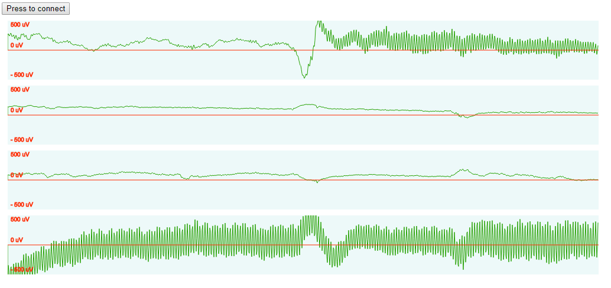

# musebrowser

Visualize the signals from your [Muse 2016 headset](https://choosemuse.com/) live in the browser, thanks in large part to [Muse-js](https://github.com/urish/muse-js)

## Installation

```bash
$ npm install
```

## Execution

```bash
$ npm run start
```

Then open your browser at `http://localhost:8080`. You will need the latest version of a mainstream browser like Chrome since the Web Bluetooth API that allows direct connection to the Muse is still experimental.

## Example



A live EEG plot of the Muse headset showing significant line interference on electrodes 1 and 4.


